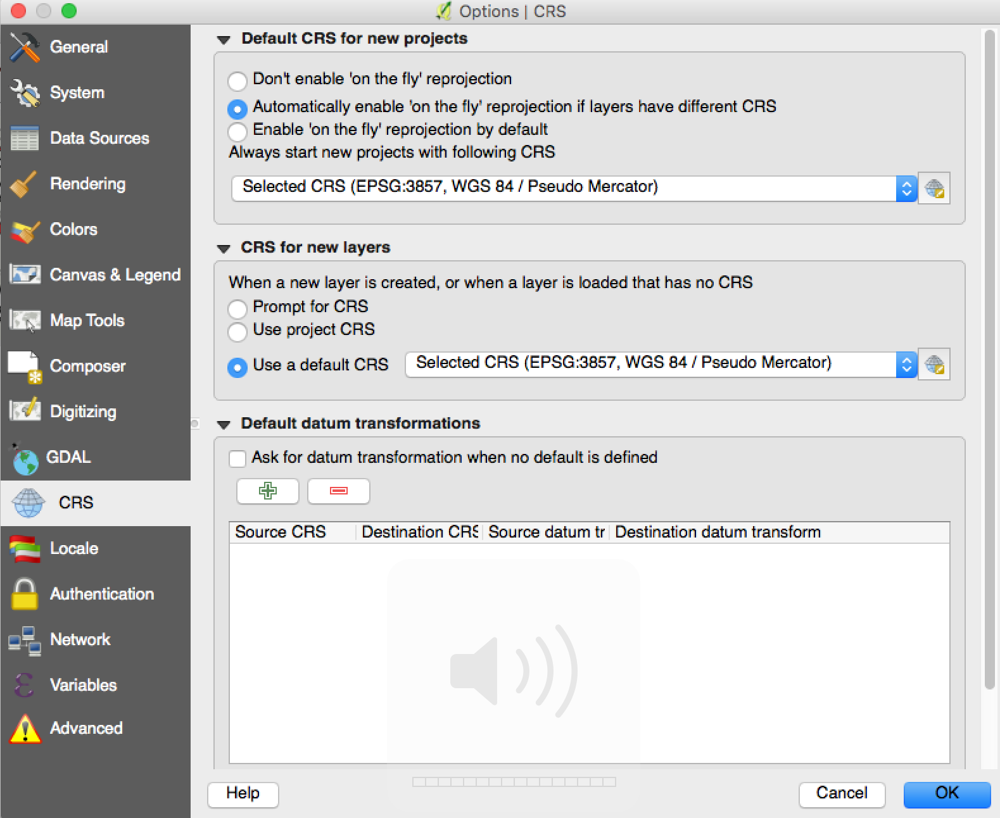
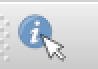
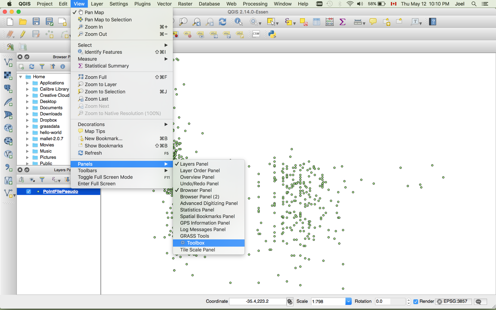
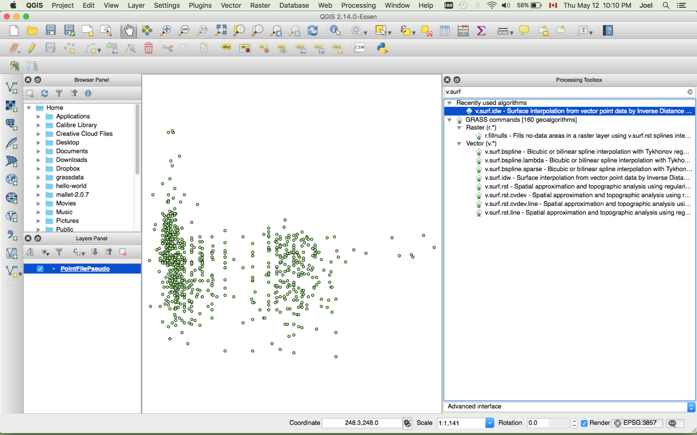
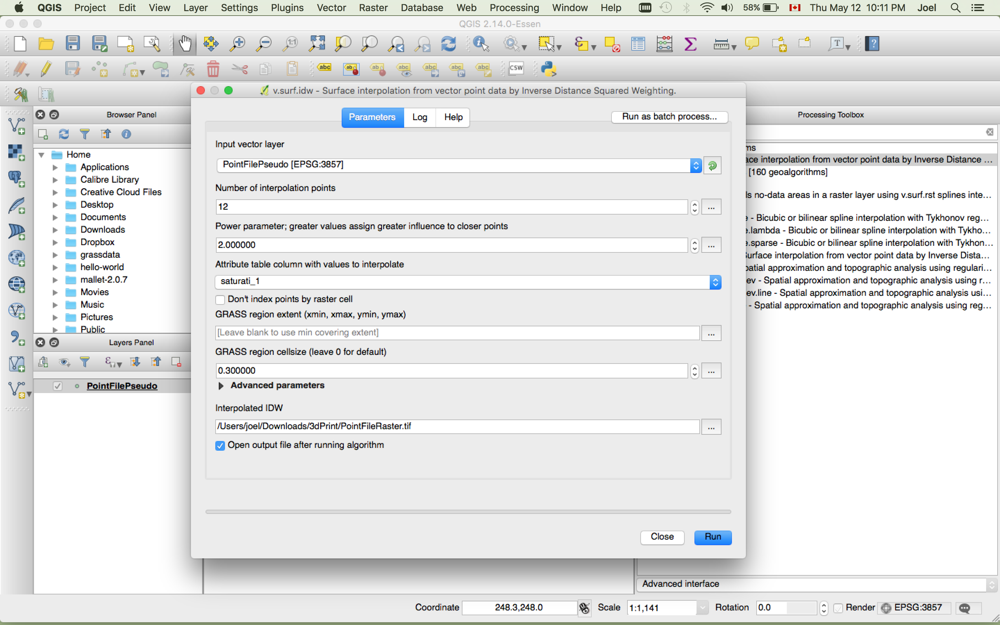
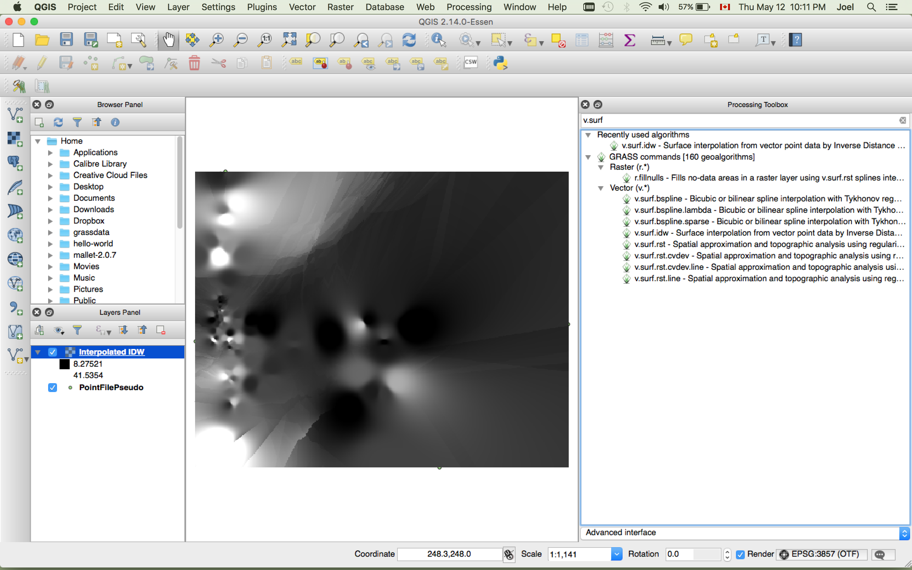
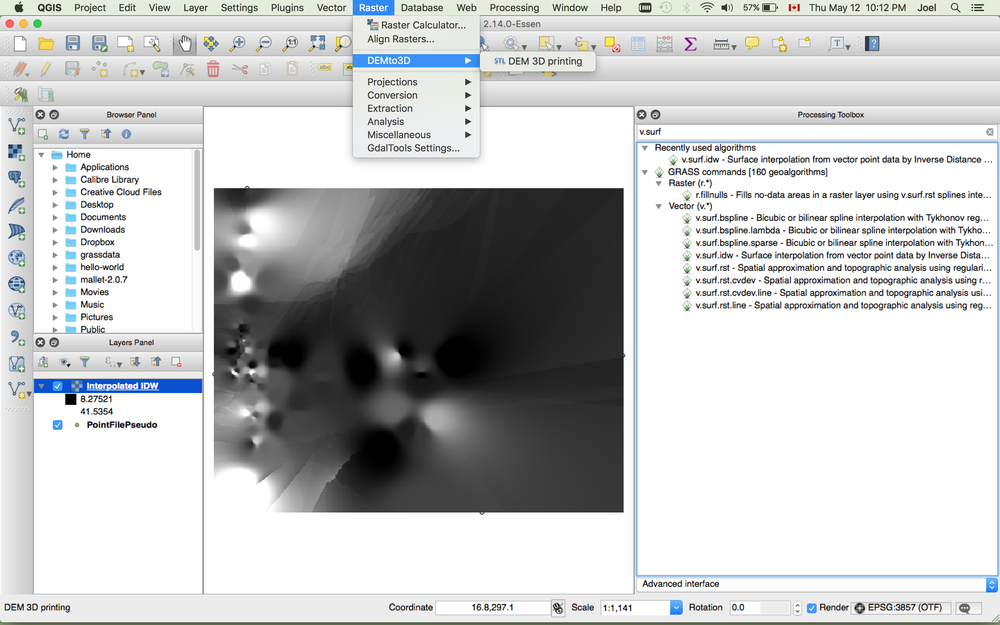
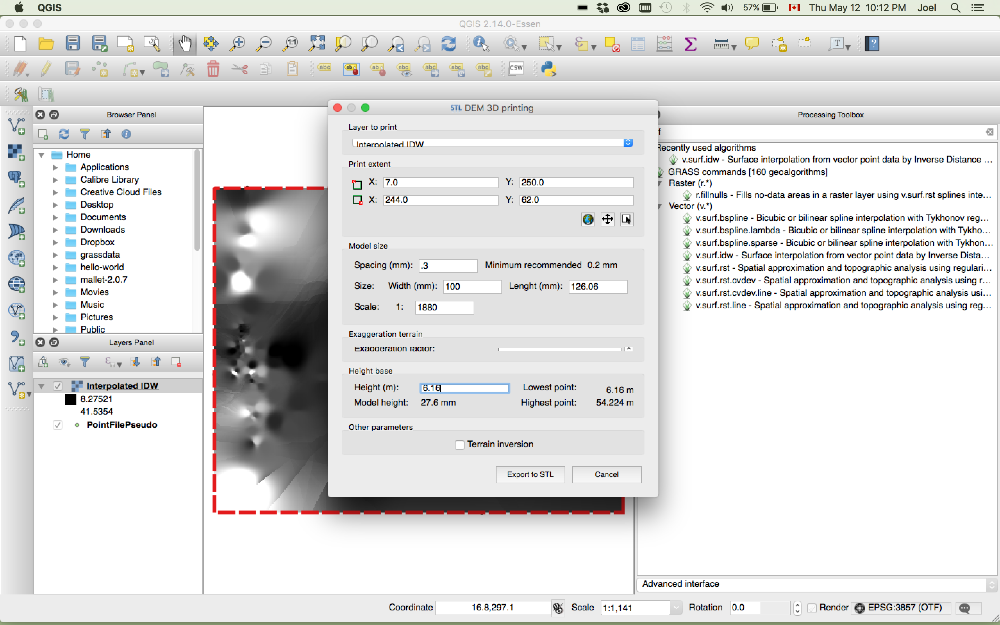

Workflow for converting from x,y,z to a 3D object using open source tools
===================
Introduction
---------------
In the description of this workflow, users are looking to print a 3D object from point values represented as x,y,z. The values inputed for x and y will represent your data in a 2D space, while the addition of the z value will add the 3rd dimension. The method outlined below is typically used to display elevation data in a geographic context, but it can also be used with other types of data. The method below will use non-geographic data to create a 3D object file.

Software used
-------
The software used in this workflow is **Quantum GIS or QGIS**. QGIS is a free open source desktop geographic information systems (GIS) application that allows users to view, edit and analyze geographic information. Users can download the tool for Windows, MAC OS X or Linux at the following website. http://www.qgis.org/en/site/forusers/download.html. The workflow below was done using QGIS 2.14 (long-term release as of April 2017) using MAC OS X. Install in this order:
  - **1 GDAL Complete.pkg**
  - **2 NumPy.pkg**
  - **3 matplotlib.pkg**
  - **4 Install QGIS.pkg**

Create a point shapefile
--------------
The data used for this workflow can be [downloaded here](/data/Xhue_Ybright_Median.txt "Sample Data"). It the median values for bones for hue, brightness and saturation.

  1. Collect or ensure that you have a comma-separated file (.csv) with values of x,y,z as seen below. Our example below uses median values for hue, brightness and saturation of images.

    
  This is displayed in a text editor, but it can also be viewed as tabular data.

  2. Open QGIS and setup your coordinate reference system (CRS) environment. Click on **Settings** > **CRS**. Under **CRS for new layers**, choose **Use a default CRS** and change it to **EPSG:3857, WGS 84 / Pseudo Mercator**.

  

  3. Next, click on **Layer** > **Add Layer** > **Add Delimited Text Layer...** This will allow us to add our .csv file in QGIS. Fill in the dialog below with these specific settings, ensuring that you assign **x field = hue_median** and **y field = bright_med**. A preview of the import of the data will appear in the dialog box.

  4. Click **Ok**.

  

  You should now see some points displayed in QGIS. You'll notice in the layers panel on the left that there is a point file. This point file is considered to be a vector feature with its geometry represented as a point. If you can't see the **Layers Panel**, select in the menu **View** > **Panels** > **Layers Panel**. In the Layers Panel, turn the layer on/off by clicking on the box next to it.  

  *Keep in mind that this point file is only **temporary** and should now be saved as a permanent file.*

  5. To save this file as a permanent file, in the Layers Panel, right click on the file and select **Save as...**

  

  Ensure you set the **CRS** to **EPSG 3857 WGS 84 / Pseudo Mercator**. Save the file as **pointfilepseudo.shp** in a directory of your choice and click **Ok**.

  6. In the Layers Panel, remove the temporary point file by right clicking on the file and clicking **remove**. You'll want to have only the pointfilepseudo in the Layers Panel.

Your data is now viewed in 2D space and represented as permanent point file. Each point (x,y) has a z value associated to it, even if we can't see it, yet. You can view the information from the z value by clicking on identify tool in QGIS and then clicking on a point.

 The underlying attribute table will appear, indicating the value of x,y and most importantly the z value.

Create a Digital Elevation Model
------------------

Our next step is to fill in the gaps between the points. To do so, we'll convert the vector point geometry to raster pixels by using an interpolation tool in QGIS. This is quite common in a GIS software, where users attempt to interpolate the elevation of the area with use the spot height points. The output product from this operation is called a digital elevation model (DEM). We'll do the same here with our non-geographic data.

  1. We'll first need to add a plugin in QGIS. In the menu go to **Plugins** > **Manage and Install Plugins...**. Search for **Processing** and install the **Processing** plugin. Click on the box next to the Processing to activate the plugin.

  2. In QGIS, click on **View** > **Panels** > **Toolbox**.

  

This will open up the **Processing Toolbox** window on the right. We'll be using one of the interpolation tools from this toolbox to create our Digital Elevation Model (DEM).

  3. In the **Processing Toolbox** search box, type **v.surf**. This will bring up various interpolation methods that can be used for your interpolation. We'll use one of the tools from GRASS (Geographic Resources Analysis Support System), which are open source tools that are integrated in QGIS.

  

  4. Double click on the **v.surf.idw - surface interpolation by...** The IDW in this particular case refers to the interpolation method of Inverse-Distance Weighted. This method essentially gives less weight to known points that are furthest when trying to interpolate the values between the points.

  5. Fill in the information as displayed in the image below to save the interpolated file as a tif image file. Click **Run** and let the algorithm run. Once complete the output will be added to the Layers Panel.

  

  You'll see various shades of grey/black/white sections when looking at the DEM raster in QGIS. Each shade of grey represents a different value of z.

Create a 3D object (.stl)
--------------------
Our 3D data is now being displayed in a 2D space. The final step is converting our data to a 3D object format. An .obj or .stl are some of the common formats that can be used by 3D printers.

In this particular case, the final 3D object will be printed on a makerbot printer, which means that we'll need to export our model to an .stl format. Lucky for us, QGIS can export directly from a DEM to an STL file. We'll first need to add another plugin.

  1. In QGIS, click **Plugins** > **Manage and Install Plugins...**

  2. In the search box, type **DEMto3d**. This should bring up the plugin that's required for our conversion. Click on the plugin and install it. Exit the plugins menu when complete.

*If the plugin fails to install properly or is missing dependencies, install the latest the Numpy package (NumPy 1.9.2-1 - www.kyngchaos.com/software/python). Once installed, close and the reopen QGIS. Re-add the digital elevation model (DEM) that you created in the previous step*.

  3. In the QGIS menu, click on **Raster** > **DEMto3D** > **DEM 3D Printing**.

  

  4. Select the **InterpolateIDW** layer and for the **print extent**, click the extent icon (middle button) to set the extent of the export. Ensure that the spacing is set to **0.3** and that the width is set to **100**. The length and the scale should fill in automatically. Lastly, set the height to match the lowest point. Once complete, click on **Export to STL**. Once prompted to save the file, select the appropriate directory.

    

  5. The exported .stl can then be used to print on a makerbot printer.

  6. If you need to convert to a different format or adjust the size or scale of the 3D object, consider using Meshlab.

*Meshlab is a free tool that can be used to view and convert between multiple 3D object formats. Meshlab can be downloaded here - http://meshlab.sourceforge.net/*
